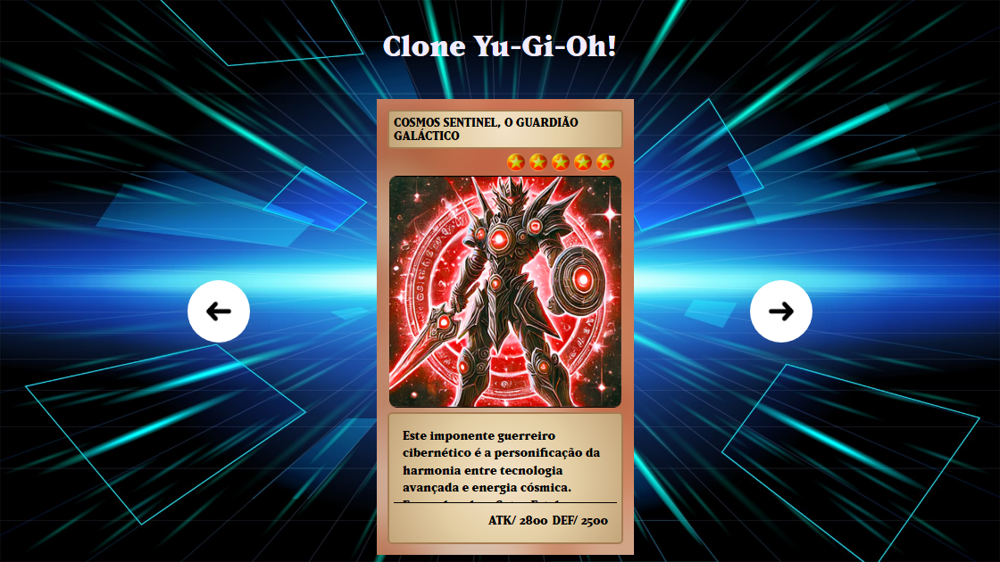

# ✨ Yu-Gi-Oh! 🃏

Bem-vindo ao README interativo do projeto "Yu-Gi-Oh!". Este projeto é uma recriação estilizada da interface de exibição de cartas do popular jogo de cartas colecionáveis Yu-Gi-Oh!, com um toque personalizado.

## 📚 Tabela de Conteúdo

* [1. Estrutura do Projeto](#1-estrutura-do-projeto)
* [2. Tecnologias Utilizadas](#2-tecnologias-utilizadas)
* [3. Funcionalidades da Aplicação](#3-funcionalidades-da-aplicação)
* [4. Como Visualizar o Projeto](#4-como-visualizar-o-projeto)
* [5. Estrutura do HTML](#5-estrutura-do-html)
* [6. Como a Interatividade Funciona (JavaScript)](#6-como-a-interatividade-funciona-javascript)
* [7. Classes CSS e Design](#7-classes-css-e-design)
* [8. Contribuindo para a Batalha!](#8-contribuindo-para-a-batalha)
* [9. Perguntas Frequentes do Duelista](#9-perguntas-frequentes-do-duelista)
* [Conclusão](#conclusão)

## 1. Estrutura do Projeto ⚙️

Este projeto está organizado da seguinte forma:

## 2. Tecnologias Utilizadas ⚙️

  
  
  

  Este projeto foi desenvolvido usando:

<ul>
    <li><strong>HTML5</strong>: Linguagem de marcação para a estrutura da página.</li>
    <li><strong>CSS3</strong>: Linguagem de estilo para a apresentação visual da página.</li>
    <li><strong>JavaScript</strong>: Linguagem de programação para adicionar interatividade à página.</li>
</ul>

## 3. Funcionalidades da Aplicação 🛠️

Este projeto implementa as seguintes funcionalidades:

*   **Slider de Cartas:** Navegue por uma lista de cartas usando botões de seta (voltar e avançar).
*   **Design Responsivo:** A interface se adapta a diferentes tamanhos de tela, incluindo dispositivos móveis e tablets.
*   **Interatividade:** Utiliza JavaScript para controlar a navegação do slider e a seleção da carta.
*   **Estilização Personalizada:** Apresenta um visual único inspirado no universo Yu-Gi-Oh!, criado com CSS.

## 4. Como Usar 🚀

Clique no botão abaixo para acessar:

## 5. Estrutura do HTML: 💻

O HTML está estruturado da seguinte forma:

*   **`<header>`**: Contém o título do projeto.
*   **`<main class="slider">`**: Contém o slider de cartas e os botões de navegação.
    *   **`<button class="btn-seta btn-voltar" id="btn-voltar">`**: Botão para navegar para a carta anterior.
    *   **`<ul class="lista-personagens">`**: Lista de cartas.
        *   **`<li class="cartao ...">`**: Cada carta é um item da lista, com classes que indicam seu fundo (`fundo-1`, `fundo-2`, etc.) e se está selecionada (`selecionado`).
            *   **`
`**: Elemento visual para simular a parte de trás da carta.
            *   **`<h2 class="nome">`**: Nome da carta.
            *   **`
`**: Representação visual do nível da carta usando estrelas.
            *   **``**: Imagem da carta.
            *   **`
`**: Contém informações sobre a carta.
                *   **`
`**: Descrição da carta.
                *   **`
`**: Ataque e defesa da carta.
    *   **`<button class="btn-seta btn-avancar" id="btn-avancar">`**: Botão para navegar para a próxima carta.
*   **``**: Link para o arquivo JavaScript que implementa a interatividade.

## 6. Como a Interatividade Funciona (JavaScript): 💻

O arquivo `src/js/index.js` contém a lógica para:

*   **Selecionar a carta ativa:** Mantém um registro de qual carta está selecionada.
*   **Navegação:** Permite a navegação entre as cartas usando os botões de seta, atualizando a classe `selecionado` da carta ativa.

## 7. Classes CSS e Design: 💻

Os arquivos CSS proporcionam o estilo da página:

*   `estilos.css`: Estilo geral do projeto, incluindo o slider, botões, layout da carta, etc.
*   `fontes.css`: Define as fontes utilizadas no projeto.
*   `reset.css`: Reseta os estilos padrão do navegador para garantir consistência entre diferentes navegadores.
*   `responsivo.css`: Ajustes para diferentes tamanhos de tela.

## 8. 🤝 Contribuindo para a Batalha! 🃏

  "O coração das cartas guiará sua contribuição."

    

       👐  Siga os passos para fortalecer este deck:
    

    <ul style="list-style-type: none; padding: 0; margin: 0;">
      <li style="margin-bottom: 10px;">
           1. 🍴 <a href="https://github.com/Domisnnet/yu-gi-oh/fork" target="_blank" style="color: #1c7430; text-decoration: underline;">Faça um fork</a>: Adicione este projeto ao seu deck.
      </li>
      <li style="margin-bottom: 10px;">
          2. 🌿 Crie uma branch: Prepare suas cartas (`git checkout -b minha-contribuicao`).
      </li>
      <li style="margin-bottom: 10px;">
          3. ✍️ Prepare seus commits: Guarde suas mudanças (`git commit -am 'Adicione minha contribuição'`).
      </li>
     <li style="margin-bottom: 10px;">
          4. 🚀 Envie suas cartas: Lance seu ataque (`git push origin minha-contribuicao`).
      </li>
      <li>
           5. ⚔️ <a href="https://github.com/Domisnnet/yu-gi-oh/compare" target="_blank" style="color: #1c7430; text-decoration: underline;">Abra um Pull Request</a>: Desafie este deck original.
      </li>
      <li>
           <a href="https://github.com/Domisnnet/yu-gi-oh/issues" target="_blank" style="color: #1c7430; text-decoration: underline;">Reportar um problema/Sugestão (Issues)</a>
      </li>
    </ul>

## 9. 🤔 Perguntas Frequentes do Duelista

**Pergunta 1:** O que é este projeto?

   **Resposta:** Este projeto é um clone interativo de cartas do jogo Yu-Gi-Oh!, desenvolvido utilizando HTML, CSS e JavaScript. Ele apresenta uma interface de "slideshow" onde você pode navegar por diferentes cartas com descrições e atributos.

**Pergunta 2:** Como funciona o sistema de cartas?

   **Resposta:** O projeto exibe uma lista de cartas, cada uma com:
    * Um nome (título)
    * Uma imagem da carta
    * Uma quantidade de estrelas representando o nível da carta.
    * Uma descrição da carta, com sua história.
    * Seus atributos de ataque (ATK) e defesa (DEF).

**Pergunta 3:** Posso usar este projeto como base para meus projetos?

   **Resposta:** Sim, o código está disponível no GitHub e você pode usá-lo como base para seus projetos, lembrando de dar os créditos apropriados.

**Pergunta 4:** Como posso entrar em contato com o desenvolvedor?

   **Resposta:** Você pode entrar em contato através do perfil do GitHub: 

<a href="https://github.com/Domisnnet">
    
    DomisDev
</a> 

## Conclusão 📝

Este README interativo fornece uma visão geral completa do projeto "Clone Yu-Gi-Oh!". Ao seguir as instruções e explorar os arquivos, você será capaz de compreender a estrutura e o funcionamento do projeto. Sinta-se à vontade para explorar e modificar este projeto!

**Links Úteis:**

* [Documentação HTML](https://developer.mozilla.org/pt-BR/docs/Web/HTML)
* [Documentação CSS](https://developer.mozilla.org/pt-BR/docs/Web/CSS)
* [Documentação JavaScript](https://developer.mozilla.org/pt-BR/docs/Web/JavaScript)

Aproveite a experiência interativa com Yu-gi-oh! ✨🃏